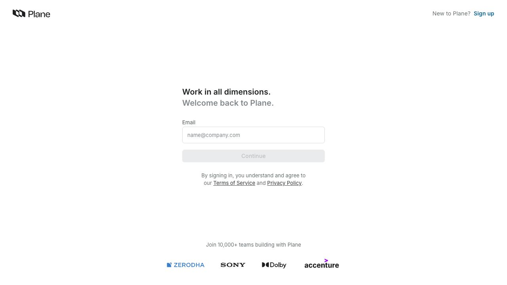
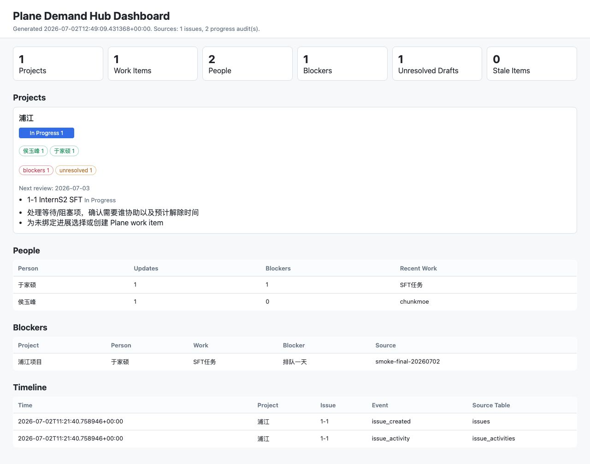
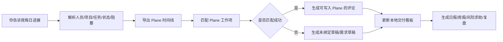

# Plane + Demand Hub 图文教程

更新时间：2026-07-02

## 先说结论

你现在看的这个页面：

```text
http://localhost:8090/teamwork/projects/e4924234-5afd-4954-989d-ac094fe75976/views/070f9a9d-21b7-4f8c-b21d-21c04d843366/
```

是 Plane 原生项目视图。它只显示已经真实写进 Plane 的工作项。

我生成的“对话进展、阻塞、未绑定草稿、交付报告”默认在本地侧车看板里：

```text
http://localhost:8765/delivery/dashboard.html
```

所以你没有在 Plane 网页里看到 `chunkmoe`，原因是：

1. `scripts/progress-to-plane.py` 默认是 dry-run 预览，不会自动写 Plane。
2. `chunkmoe` 当前没有匹配到现有 Plane 工作项，所以被保留为“未绑定草稿”。
3. 只有匹配到现有工作项的内容，例如 `SFT任务 -> 1-1 InternS2 SFT`，才可以在设置 `PLANE_API_KEY` 后写成 Plane 评论。
4. “新增 Plane 工作项”现在仍是草稿，不会在你未确认时自动创建。

## 1. 先登录 Plane

如果打开深链后看到下面这个页面，说明当前浏览器没有登录 Plane。



处理方式：

1. 打开 `http://localhost:8090/`。
2. 用你的邮箱登录；如果是第一次使用本地 Plane，就点右上角 `Sign up` 创建账号。
3. 登录后进入 workspace `teamwork`。
4. 进入项目 `浦江`。
5. 再打开原来的项目视图深链。

登录成功后，Plane 原生页面里通常会看到：

- 左侧：Workspace、Projects、Views 等导航。
- 中间：当前项目或视图里的工作项列表。
- 工作项：例如 `1-1 InternS2 SFT`。

## 2. Plane 原生项目页看什么

Plane 是最终的任务系统，适合看和维护这些信息：

- 工作项是否真实存在。
- 工作项状态：Backlog、Todo、In Progress、Done 等。
- 工作项负责人、优先级、标签、周期、模块。
- 评论、活动历史、附件。
- 项目视图过滤后的任务列表。

你给的 URL 是项目视图页。它可能因为过滤条件不同，只显示一部分工作项。如果某个任务没有出现，常见原因是：

- 还没有被创建到 Plane。
- 被当前 view 的过滤条件排除了。
- 任务在别的 project、cycle、module 或状态里。
- 浏览器还没登录，深链被重定向到了登录页。

## 3. 本地交付看板看什么

我生成的本地交付看板是“侧车视图”，它把 Plane 数据库里的真实任务和你对话里告诉我的进展证据合在一起。



这个页面目前显示：

- `1 Projects`：当前识别到 `浦江` 项目。
- `1 Work Items`：Plane 中真实存在的 `1-1 InternS2 SFT`。
- `2 People`：从对话进展里识别到 `于家硕` 和 `侯玉峰`。
- `1 Blockers`：`于家硕 / SFT任务 / 排队一天`。
- `1 Unresolved Drafts`：`侯玉峰 / chunkmoe` 没匹配到 Plane 工作项，需要创建或绑定。

打开方式：

```bash
cd /Users/Zhuanz/Documents/DevTracking
python3 -m http.server 8765 -d exports
```

然后浏览器打开：

```text
http://localhost:8765/delivery/dashboard.html
```

如果 8765 端口已经在跑，可以直接打开，不需要重复启动。

## 4. 以后你怎么和我交互

你可以直接像这样告诉我：

```text
侯玉峰，浦江项目，开发chunkmoe；于家硕，浦江项目，SFT任务排队一天。
```

我会执行这条本地命令：

```bash
cd /Users/Zhuanz/Documents/DevTracking
scripts/progress-to-plane.py "侯玉峰，浦江项目，开发chunkmoe；于家硕，浦江项目，SFT任务排队一天。"
```

输出会分成两类：

- `apply_ready`：已经匹配到 Plane 工作项，可以写入 Plane 评论。
- `manual_target_required`：没有匹配到工作项，需要先创建或指定目标任务。

当前样例的结果是：

```text
侯玉峰: 浦江项目 / chunkmoe [in_progress; issue=unresolved]
于家硕: 浦江项目 / SFT任务 [waiting; issue=1-1 InternS2 SFT]
```

这意味着：

- `于家硕 / SFT任务` 能写到 `1-1 InternS2 SFT` 的评论里。
- `侯玉峰 / chunkmoe` 需要先在 Plane 新建工作项，或告诉我它应该绑定到哪个已有工作项。

## 5. 怎么把进展真的写回 Plane

默认命令不会写 Plane，这是为了防止误操作。

如果只想预览：

```bash
scripts/progress-to-plane.py "于家硕，浦江项目，SFT任务排队一天。"
```

如果确认要写评论，需要先在 Plane 里生成 API Key，然后设置环境变量：

```bash
export PLANE_API_KEY="<你的 Plane API Key>"
scripts/progress-to-plane.py --apply "于家硕，浦江项目，SFT任务排队一天。"
```

注意：

- `--apply` 目前只会给已匹配的 Plane 工作项添加评论。
- 未匹配的 `chunkmoe` 不会自动写入。
- 不要把 `PLANE_API_KEY` 写进仓库、文档或聊天记录。

## 6. 怎么让 `chunkmoe` 出现在 Plane 里

现在有两个安全做法。

### 做法 A：手动在 Plane 创建

1. 登录 `http://localhost:8090/`。
2. 进入 workspace `teamwork`。
3. 进入项目 `浦江`。
4. 在工作项列表里点击 `New` / `Add work item` / `+`。
5. 标题填：`chunkmoe 性能优化`。
6. 负责人选：`侯玉峰`。
7. 优先级可以设为 High。
8. 创建后再告诉我：`侯玉峰，浦江项目，chunkmoe 性能优化正在开发`。

下一次我导出 Plane 时间线后，就能把对话进展绑定到这个真实工作项。

### 做法 B：先走需求分诊草稿

```bash
scripts/triage-demand.py \
  --requirement "浦江项目需要新增chunkmoe性能优化任务，优先级高，影响SFT交付" \
  --dashboard exports/delivery/dashboard.json \
  --output-dir exports/demand
```

查看草稿：

```bash
cat exports/demand/triage.md
cat exports/demand/planned-plane-changes.json
```

当前草稿会推荐：

- 新增任务：`浦江项目需要新增chunkmoe性能优化任务，优先级高，影响SFT交付`
- 推荐负责人：`侯玉峰`
- 原因：历史进展里出现 `chunkmoe`，且当前没有阻塞

## 7. 每天维护交付方案的固定流程

每天你只要把进展告诉我，我会按这个顺序维护：



常用命令：

```bash
cd /Users/Zhuanz/Documents/DevTracking

# 1. 从 Plane 读真实任务和活动
scripts/export-plane-timeline.sh --since 1970-01-01T00:00:00Z --output exports/plane/timeline.jsonl

# 2. 录入今天进展
scripts/progress-to-plane.py "某人，某项目，某任务完成/开发/排队..."

# 3. 生成本地交付看板
scripts/build-delivery-dashboard.py \
  --timeline exports/plane/timeline.jsonl \
  --progress-dir exports/progress \
  --output-dir exports/delivery

# 4. 生成日报、周报、风险求助和 AI 历史上下文
scripts/generate-delivery-reports.py \
  --dashboard exports/delivery/dashboard.json \
  --output-dir exports/reports \
  --backup-dir exports/backup
```

## 8. 这套系统的边界

当前 v1 的边界是：

- 可以读 Plane 数据库。
- 可以解析你给我的自然语言进展。
- 可以生成本地可视化、日报、周报、风险求助和复盘。
- 可以在设置 API Key 后，把已匹配工作项的进展写成 Plane 评论。
- 暂时不会自动创建 Plane 工作项。
- 暂时不会自动改 Plane 状态、负责人、优先级。

这个边界是故意收紧的：先保证不会误写任务系统。等你确认交互方式稳定后，可以进入 v2，把“确认后的新需求自动创建 Plane 工作项”和“确认后的阻塞自动打标签/改状态”加上。
